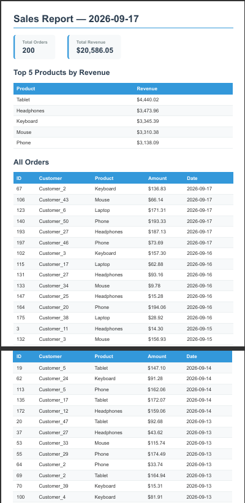

# PDF Report Generator

A report pipeline that queries a SQLite database, renders data into an HTML template, and generates a downloadable PDF using Playwright. Built with FastAPI, SQLite, and Playwright (headless Chromium).

## Dataset

**Option A — The Little Shop:** 200 random orders with 6 products (Laptop, Phone, Tablet, Headphones, Keyboard, Mouse), random amounts ($5–$200), and random dates in the last 30 days.

## How to Run

```bash
# 1. Install dependencies
pip install -r requirements.txt
playwright install chromium

# 2. Seed the database (safe to run twice)
python seed.py          # 200 rows (default)
python seed.py 5000     # 5000 rows for stress test

# 3. Start the server
uvicorn main:app --reload

# 4. Generate a report
curl -X POST http://localhost:8000/reports

# 5. Filter by days
curl -X POST http://localhost:8000/reports -H "Content-Type: application/json" -d '{"days": 7}'

# 6. List all reports
curl http://localhost:8000/reports

# 7. Download the PDF
curl -o report.pdf http://localhost:8000/reports/<id>/file
```

## PDF Screenshot



## Aggregation SQL

```sql
-- Total number of orders
SELECT COUNT(*) as total_orders FROM orders;

-- Total revenue
SELECT SUM(amount) as total_revenue FROM orders;

-- Top 5 products by revenue
SELECT product, SUM(amount) as revenue
FROM orders
GROUP BY product
ORDER BY revenue DESC
LIMIT 5;

-- Orders per day for the last 7 days
SELECT created_at as date, COUNT(*) as orders
FROM orders
WHERE created_at >= date('now', '-7 days')
GROUP BY created_at
ORDER BY created_at;
```

## API Endpoints

| Method | Endpoint | Description |
|--------|----------|-------------|
| GET | `/health` | Health check |
| GET | `/reports` | List all generated reports |
| POST | `/reports` | Generate a report (idempotent) |
| POST | `/reports` | `{"days": 7}` — filter orders by last N days |
| POST | `/reports` | `{"force": true}` — bypass idempotency check |
| GET | `/reports/:id` | Get report metadata |
| GET | `/reports/:id/file` | Download the PDF |

## POST → Download Proof

```
$ curl -s -X POST http://localhost:8000/reports
{"id":2,"file":"/reports/2/file"}

$ curl -o report.pdf http://localhost:8000/reports/2/file
  % Total    % Received % Xferd  Speed Time
100 63306  100 63306    0     0  241k      0 --:--:-- --:--:-- --:--:-- 242k

$ file report.pdf
report.pdf: PDF document, version 1.4
```

## Idempotency (Stage 5)

Two rapid POSTs return the same id and create only one file. A `{"force": true}` request bypasses the check and creates a new report.

## Big Table Experiment (Stage 6)

With 5,000 rows, the POST `/reports` endpoint takes **~4.42 seconds** to generate a 210-page PDF (596 KB). This is acceptable for a single user clicking a button, but becomes fragile under load — a request that takes seconds keeps the client waiting and blocks the server. This is exactly the problem background jobs solve: move the work to a queue, return immediately with a job ID, and let the client poll for completion.

## Design Decisions

**Stage 4:** The POST endpoint runs the full pipeline (query → render → store) inline. For production with large reports or many users, this work should move to a background job to avoid keeping the client waiting.

**Stage 5:** The idempotency check prevents duplicate reports when a user double-clicks "Generate report". A real-world example: charging a customer twice for the same order because the payment endpoint was called twice.

## Author

AI Engineer | Deep Learning | Computer Vision | GEN AI | Agentic AI